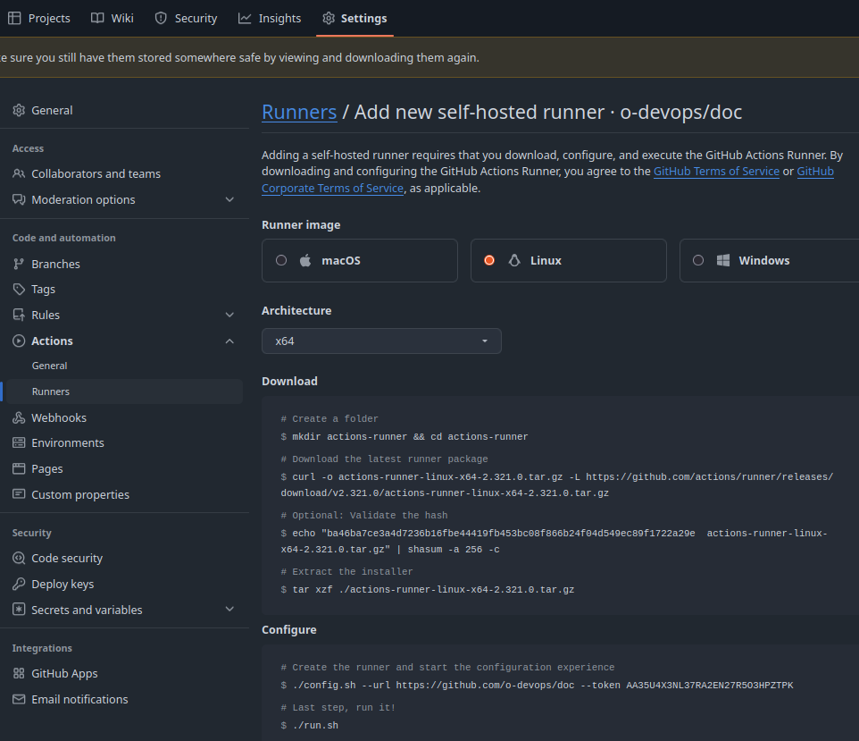
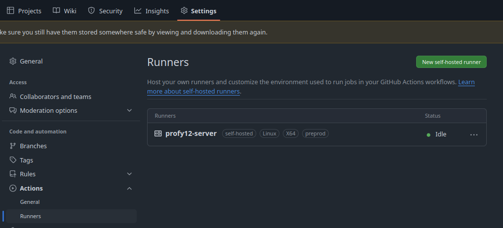

---
tags:
  - Github Action
  - CD
---

# L'exécuteur local (local runner)

Le local runner permet de dérouler des actions Github Action directement sur le serveur de votre choix, mais aussi pourquoi pas votre poste de travail ou un raspberry pi chez vous.

Si vous avez un hébergement classique en standalone (vps/ec2/raspberry pi auto hébergé), alors c'est la façon la plus efficace de déployer son code.

Dans ce cas vous pouvez imaginer deux scénari de workflow :

- Un workflow à l'ancienne qui va copier le code et le mettre au bon endroit sur votre serveur (par exemple /var/www/html). C'est le scénario que nous allons retenir.
- Un workflow un peu plus moderne qui va utiliser l'environnement Docker de votre serveur pour lancer l'application, par exemple via un Docker Compose.


## Pré-requis

Sur notre serveur nous devons avoir au préalable :

- Un serveur web (Apache2/Nginx/Caddy), l'exemple sera ici avec Apache2.


## Installer le runner local avec votre utilisateur

En utilisant l'utilisateur par défaut (student ou ubuntu) installez le runner Github Action, en suivant la documentation.



Terminez l'installation en installant le service système avec `./svc.sh install`

Modifier le fichier de service généré dans `/etc/systemd/system/action-...` pour le lancer avec votre compte utilisateur.

Lancez et activez votre service :

``` bash
sudo -i
systemctl daemon-reload
systemctl start worker-...
systemctl enable worker-...
systemctl status worker-...

```
NB: worker-... ref===>  actions.runner-......

Vérifiez dans l'interface Github que le runner est bien up est dans l'état `idle`



## Préparez une application web à déployer

Préparez un dépot Github avec dedans un site web, éventuellement très simple : un simple fichier index.html suffit.

```html
<html>
<head>
    <title>DevOps sample site</title>
</head>
<body>
Hello les DevOps !
</body>
</html>
```

## Ecriture du workflow

Ecrivez un premier workflow simple qui affiche un simple `Hello Devops !`, le workflow doit contenir la logique suivante :

- Connectez le workflow a deux events, le push main et schedule
- Dans job nommé deploy
  * Récuperer le code du projet de documentation
  * copier les fichier statiques dans le répertoire servi par votre serveur web (/var/www/html/ pour Apache2)

## Test du workflow

Effectuez un commit dans main avec votre workflow et vérifiez si le site est bien déployé sur le serveur.

## Exemple du workflow fonctionnel

```yaml

---
name: preprod release

on:
  workflow_dispatch:
  push:
    branches:
      - preprod

jobs:
  build:
    runs-on: ubuntu-latest

    steps:
      - name: Get data from repository
        uses: actions/checkout@v4

      - run: docker build --target build -t mkdocs-builder .

      - run: docker container run --rm -v ./site:/app/site mkdocs-builder

      - name: Upload static files as artifact
        id: deployment
        uses: actions/upload-artifact@v4 # or specific "vX.X.X" version tag for this action
        with:
          path: site/
          name: notredoc
  deploy:
    runs-on: 
      - self-hosted
    needs: build
    steps:
      - uses: actions/download-artifact@v4 
        with:
          path: /var/www/html
          name: notredoc
```

## Conclusion

Le runner local vous permet de déployer très rapidement vos modifications sur un serveur de production et d'automatiser tout le processus de mise à jour.

Le développeur devient entièrement autonome pour publier son site web et peut modifier si besoin le contenu du fichier de workflow Github Action.

Cette partie illustre seulement la partie qu'on appele CD, car on délivre en continue mais dans notre cas simple on ne passe pas par des étapes de build.


## Aller plus loin

Utiliser mkdocs pour construire une application plus aboutie et ajouter un job de build dans votre workflow.

Pour builder votre site avec mkdocs build, vous pouvez le faire de deux manière :

- directement sur la production en ajoutant une étape de build avant de copier nos fichiers.
- dans un premier job qu'on nommerait build et qui s'exécuterait pas sur le serveur de production mais dans le Cloud Azure.

Bien entendu la deuxième technique est plus pertinente car évite d'avoir un environnement de build sur notre serveur, cependant il faudra trouver une solution pour échanger les données de build et les passer à notre job de déploiement et utiliser les artifacts.